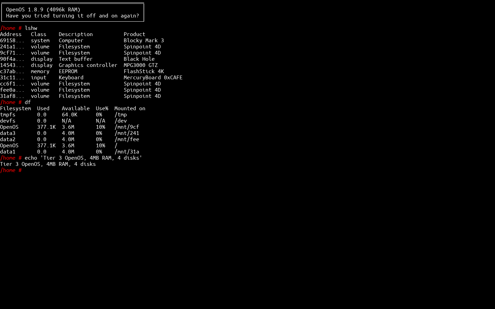

# OpenComputersSim

A desktop simulator for the Minecraft mod
[**OpenComputers**](https://github.com/MightyPirates/OpenComputers).

It boots the **real OpenOS** (vendored straight from the mod) on an embedded
**Lua 5.3** runtime and opens a window that looks and behaves exactly like an
in-game **Tier 3 screen**. You get a genuine OpenOS shell — the same `lua`
interpreter, the same `bin/` programs, the same `/lib` APIs — not a
reimplementation.



## The simulated machine

The default machine is exactly the one requested:

| Component | Spec |
|-----------|------|
| CPU       | Tier 3 |
| GPU       | Tier 3 (160×50, 8-bit colour) |
| Screen    | Tier 3 |
| Memory    | 4 × Tier 3.5 RAM (4096 KiB total) |
| Storage   | 4 × Tier 3 hard drives (4 MiB each) |
| EEPROM    | Lua BIOS |

OpenOS is installed on the first hard drive (the boot disk); the other three
appear under `/mnt`. Disks persist between runs under `~/.opencomputerssim`.

## How it works

OpenComputers runs its guest OS in a sandboxed Lua VM driven by the native
mod. OpenComputersSim recreates that environment in Python:

* **`lupa`** embeds a real **Lua 5.3** interpreter (the same version
  OpenComputers uses).
* **`ocsim/lua/bootstrap.lua`** is a slim re-implementation of the mod's
  `machine.lua`. It installs the same *bubbling coroutine* library, so a system
  yield from `computer.pullSignal` propagates up through every nested OpenOS
  process coroutine to the host — the mechanism that makes OpenOS's cooperative
  multitasking work.
* **`ocsim/components/`** implements the hardware as OpenComputers components
  (`gpu`, `screen`, `keyboard`, `filesystem`, `eeprom`, `computer`), exposed to
  Lua through the standard `component` / `computer` / `unicode` APIs.
* The EEPROM **Lua BIOS** loads `/init.lua` from the boot disk, which boots
  real OpenOS.
* **`ocsim/osfiles/`** is the unmodified OpenOS filesystem from the mod
  (`MightyPirates/OpenComputers`, branch `master-MC1.12`).
* A **display back-end** turns the screen's cell buffer into pixels and turns
  keyboard/mouse input into OpenComputers signals (using the real LWJGL2 key
  codes).

## Requirements

* Python 3.9+
* `pip install -r requirements.txt` (installs `lupa` and `pygame`)

`lupa` ships a bundled Lua 5.3, so no system Lua is required.

## Usage

```bash
pip install -r requirements.txt

python run.py                       # open the Tier 3 display window
python run.py --spec                # print the machine specification
python run.py --headless "lshw; df" # boot without a GUI and print the screen
python run.py --fresh               # factory reset the disks first
python run.py --font-size 22        # bigger text / bigger window
```

You can also run it as a module:

```bash
python -m ocsim --spec
```

Once the window is open you have a full OpenOS prompt. Try:

```
lshw            # list the Tier 3 hardware
df              # show the four hard drives
edit hello.lua  # OpenOS text editor
lua             # interactive Lua 5.3 REPL
help            # built-in help
reboot          # restart the machine (disks persist)
shutdown        # close the machine
```

Anything you can do in OpenOS works here, including downloading programs from
the internet with `wget` / `pastebin` (OpenOS uses the `internet` card; see
*Limitations*).

## Controls

* Type normally; the shell supports history (↑/↓), tab completion and the usual
  line editing.
* **Ctrl+C** interrupts the running program (just like in-game).
* **Ctrl+V** pastes from the system clipboard.
* Mouse clicks/drag/scroll are delivered as `touch` / `drag` / `scroll`
  signals.
* Close the window to power the machine off.

## Tests

```bash
python tests/test_boot.py
```

These boot the real OpenOS headlessly and exercise a handful of commands; they
need `lupa` but not `pygame`.

## Limitations

* Components that need real-world I/O are not implemented yet: there is no
  `internet` card (so `wget`/`pastebin` have nothing to talk to), no `modem`
  networking, and no redstone/robot peripherals. The CPU/GPU/RAM/disk/screen/
  keyboard/EEPROM set the requested machine needs is complete.
* The host display is true-colour, so the GPU stores exact 24-bit colours
  instead of applying OpenComputers' 8-bit palette deflation. Output therefore
  looks slightly crisper than in-game but behaves identically.

## Credits

OpenOS and the OpenComputers behaviour reproduced here are the work of the
OpenComputers team (MightyPirates GmbH & Co. KG) and contributors, used under
the OpenComputers license. The bundled display font is Ubuntu Mono (Ubuntu Font
Licence 1.0).
