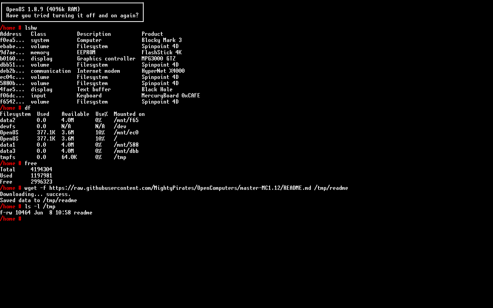

# OpenComputersSim

A desktop simulator for the Minecraft mod
[**OpenComputers**](https://github.com/MightyPirates/OpenComputers).

It boots the **real OpenOS** (vendored straight from the mod) on an embedded
**Lua 5.3** runtime and opens a window that looks and behaves exactly like an
in-game **Tier 3 screen**. You get a genuine OpenOS shell — the same `lua`
interpreter, the same `bin/` programs, the same `/lib` APIs — not a
reimplementation.

It renders with **GNU Unifont** — the exact bitmap font OpenComputers uses
in-game — so the screen is pixel-for-pixel what you'd see in Minecraft.



More screenshots (boot, hardware, internet card, Lua REPL) are in
[`screenshots/`](screenshots/).

## The simulated machine

The default machine is exactly the one requested:

| Component | Spec |
|-----------|------|
| CPU       | Tier 3 |
| GPU       | Tier 3 (160×50, 8-bit colour) |
| Screen    | Tier 3 |
| Memory    | 4 × Tier 3.5 RAM (4096 KiB total) |
| Storage   | 4 × Tier 3 hard drives (4 MiB each) |
| Internet  | Internet card (HTTP + TCP) |
| EEPROM    | Lua BIOS |

OpenOS is installed on the first hard drive (the boot disk); the other three
appear under `/mnt`. Disks persist between runs under `~/.opencomputerssim`.

## How it works

OpenComputers runs its guest OS in a sandboxed Lua VM driven by the native
mod. OpenComputersSim recreates that environment in Python:

* **`lupa`** embeds a real **Lua 5.3** interpreter (the same version
  OpenComputers uses).
* **`ocsim/lua/bootstrap.lua`** is a slim re-implementation of the mod's
  `machine.lua`. It installs the same *bubbling coroutine* library, so a system
  yield from `computer.pullSignal` propagates up through every nested OpenOS
  process coroutine to the host — the mechanism that makes OpenOS's cooperative
  multitasking work.
* **`ocsim/components/`** implements the hardware as OpenComputers components
  (`gpu`, `screen`, `keyboard`, `filesystem`, `eeprom`, `internet`, `computer`),
  exposed to Lua through the standard `component` / `computer` / `unicode` APIs.
* The EEPROM **Lua BIOS** loads `/init.lua` from the boot disk, which boots
  real OpenOS.
* **`ocsim/osfiles/`** is the unmodified OpenOS filesystem from the mod
  (`MightyPirates/OpenComputers`, branch `master-MC1.12`).
* A **display back-end** turns the screen's cell buffer into pixels and turns
  keyboard/mouse input into OpenComputers signals (using the real LWJGL2 key
  codes).

## Requirements

* Python 3.9+
* `pip install -r requirements.txt` (installs `lupa` and `pygame`)

`lupa` ships a bundled Lua 5.3, so no system Lua is required.

## Usage

```bash
pip install -r requirements.txt

python run.py                       # open the Tier 3 display window
python run.py --spec                # print the machine specification
python run.py --headless "lshw; df" # boot without a GUI and print the screen
python run.py --fresh               # factory reset the disks first
python run.py --scale 2             # bigger pixels (default auto-fits screen)
python run.py --font ttf            # use Ubuntu Mono instead of Unifont
```

The window auto-sizes to fit your monitor. The authentic Unifont renders at
8×16 pixels per cell, so `--scale 1` is a true 1280×800 OpenComputers screen
and `--scale 2`/`3` make it bigger.

You can also run it as a module:

```bash
python -m ocsim --spec
```

Once the window is open you have a full OpenOS prompt. Try:

```
lshw            # list the Tier 3 hardware
df              # show the four hard drives
edit hello.lua  # OpenOS text editor
lua             # interactive Lua 5.3 REPL
help            # built-in help
reboot          # restart the machine (disks persist)
shutdown        # close the machine
```

The machine has an **internet card**, so you can pull programs and files
straight from the web:

```
wget https://example.com/program.lua
pastebin get <id> program.lua
```

(Network access is subject to your machine's firewall/network policy.)

## Configuration

The first time you run it, a config file is created at
`~/.opencomputerssim/machine.json`. Edit it and restart to change the hardware —
no code changes needed. Print the current path and contents with:

```bash
python run.py --print-config
```

Example: a beefier machine with 16 MiB of RAM and six drives:

```json
{
  "cpu_tier": "3",
  "gpu_tier": "3",
  "screen_tier": "3",
  "ram_sticks": ["3.5", "3.5", "3.5", "3.5"],
  "ram_total_kb_override": 16384,
  "disks": [
    { "tier": "3", "label": "OpenOS" },
    { "tier": "3", "label": "data1" },
    { "tier": "3", "label": "data2" },
    { "tier": "3", "label": "data3" },
    { "tier": "2", "label": "scratch" },
    { "tier": "1", "label": "floppy", "readonly": true }
  ],
  "tmpfs_capacity_kb": 64,
  "internet_card": true,
  "display": { "font": "unifont", "scale": 0, "font_size": 18 }
}
```

| Field | Meaning |
|-------|---------|
| `cpu_tier` / `gpu_tier` / `screen_tier` | `"1"`, `"2"` or `"3"` |
| `ram_sticks` | list of RAM tiers (`1`, `1.5`, `2`, `2.5`, `3`, `3.5`); KiB per stick: 192/256/384/512/768/1024 |
| `ram_total_kb_override` | set `> 0` to force an exact RAM size in KiB, ignoring `ram_sticks` |
| `disks` | list of drives; tier `1`/`2`/`3` = 1/2/4 MiB. The **first disk is the boot disk** (OpenOS). |
| `tmpfs_capacity_kb` | size of the `/tmp` RAM disk |
| `internet_card` | `true`/`false` |
| `display.font` | `"unifont"` (authentic) or `"ttf"` |
| `display.scale` | pixel scale, `0` = auto-fit |

Use a different config or data directory with `--config PATH` / `--data-dir PATH`.
CLI flags (`--font`, `--scale`, `--font-size`) override the file for one run.

## Controls

* Type normally; the shell supports history (↑/↓), tab completion and the usual
  line editing.
* **Ctrl+C** interrupts the running program (just like in-game).
* **Ctrl+V** pastes from the system clipboard.
* Mouse clicks/drag/scroll are delivered as `touch` / `drag` / `scroll`
  signals.
* Close the window to power the machine off.

## Tests

```bash
python tests/test_boot.py
```

These boot the real OpenOS headlessly and exercise a handful of commands; they
need `lupa` but not `pygame`.

## Limitations

* Implemented components: CPU, GPU, screen, keyboard, hard drives, EEPROM and
  the internet card (HTTP + TCP). Not yet implemented: `modem`/network-card
  multiplayer networking, and redstone/robot/drone peripherals.
* The host display is true-colour, so the GPU stores exact 24-bit colours
  instead of applying OpenComputers' 8-bit palette deflation. Output therefore
  looks slightly crisper than in-game but behaves identically.
* Wide (CJK) glyphs render in a single cell rather than occupying two; ASCII
  and Latin text are pixel-accurate.

## Credits

OpenOS and the OpenComputers behaviour reproduced here are the work of the
OpenComputers team (MightyPirates GmbH & Co. KG) and contributors, used under
the OpenComputers license. The bundled display font is Ubuntu Mono (Ubuntu Font
Licence 1.0).
